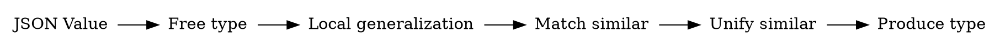

```{.haskell .hidden}
import qualified Data.Set as Set
import           Data.Set(Set)

```
Minimal definition of the type:

```haskell
class Monoid ty
   => Types ty term | ty -> term where
  infer :: term -> type
  check :: type -> term -> Bool

-- Laws:
class_law_types :: Types ty term =>
class_law_types term = check (infer term) term == True
```

Note that `Monoid` operation is a type unification.

Since we are interested in JSON, we use JSON term, instead of more general definition:
```
data Value =
    Object Object
  | Array  Array
  | String Text
  | Number Scientific
  | Bool   Bool
  | Null
```


Now for a term with constructors we can infer "free" type for every term:
```
data family FreeType :: * -> *

data FreeType Value =
    TObj Map.Map String FreeType
  | TArr [FreeType]
  | TString StringConstraint
  | TNumber NumberConstraint

```

In other words, for any type `T` `Set T` satisfies our notion of free type,
with `infer = Set.singleton`, `check = flip Set.member`, and `<>`.
This definition is sound, and for a finite realm of values, may make a sense.
For example for a set of inputs:
`"yes", "no", "error"`, we might reasonably say that type is indeed
a good approximation of C-style enumeration, or Haskell-style ADT without constructor arguments.

What is wrong with this notion of _free type_?
It does not generalize at all! It only allows the objects from the sample, and nothing more.
Clearly after seeing `a: false` we can expect that it is sometimes `a: true`.
After seeing `b: 123` we expect that `b: 100` would also be acceptable.
That means that we need our typing to _learn a reasonable general class from few instances._
That defines making a practical type system as inference problem.

Since our goal is to deliver most descriptive^[Shortest, by information complexity principle.]
types, we will assume that we need to abstract a bit from the _free type_ and take on larger
sets whenever it seems justified.

Indeed we want to use this theory to infer a type definition from a finite set of examples,
but we also want it to generalize to infinite types.

Aiming for this, we set the rules of type design:

* type should have a finite description
* inference must be contravariant functor with regards to constructors, for `{"a": X, "b": Y}` is types
  by `T x y`,
  then `X :: x` and `Y :: y` must be also a valid typing.

## JSON examples

Now let's give some motivating examples from realm of JSON API types:

1. Subsets of constructors:
  * _API argument is email_ - this is subset of valid `String` values, that we can usefully validate on the client.
  * _Page size determines number of results to return (min: 10, max:10000)_ - this is also a subset of `Int` values between `10`, and `10000`
  * _`timestamp` contains ISO8601 date_ -- that is `String` like `"2019-03-03"` but not like `"The third day of March of the year 2019"`
2. Optional fields:
  * _Page size is 100 by default_ - that is we have `{"page_size": 50}` or `{}`
3. Variant fields:
  * _Answer to the query is either a number of of registered objects, or String `"unavailable"`_ - this is `Int` value or a `String`
4. Variant records:
  * _Answer contains either text message with user id, or an error._ -- That is either:
    - `{"message" : "Where can I submit my proposal?", "uid"  : 1014}`
    - `{"error"   : "Authorization failed",            "code" :  401}`

5. Arrays in place of records^[Which strikes author as a bad practice, but we want to handle it nevertheless. Possible with `--bad-array-records` option.]:
```{.json}
[
  [1, "Nick",    null       ]
, [2, "George", "2019-04-11"]
, [3, "Olivia", "1984-05-03"]
]
```

6. Maps of identical objects:
```
{
    "0000000000000000000e222e4e7afc29c49f6398783a94c846dee2e13c6408f5": {
        "size": 969709,
        "height": 510599,
        "difficulty": 3007383866429.732,
        "previous": "000000000000000000552a7783efd39eaa1c5ff6789e21a0bbe7547bc454fced"
	},
	"000000000000000000552a7783efd39eaa1c5ff6789e21a0bbe7547bc454fced": {
	    "size": 991394,
        "height": 510598,
        "difficulty": 3007383866429.732,
        "previous": "00000000000000000043aba4c065d4d92aec529566287ebec5fe9010246c9589"
	},
	"00000000000000000043aba4c065d4d92aec529566287ebec5fe9010246c9589": {
        "size": 990527,
        "height": 510597,
        "difficulty": 3007383866429.732,
        "previous": "00000000000000000009025b9e95911a4dc050de129ea4eb5e40ef280751a0cb"
	}
}
```

### What is the point of inference?

Given another undocumented (or wrongly labelled) JSON API, we want to read the input
into Haskell, and avoid checking for _unexpected_ deviations of the format.
At the same time, we want to accept all known valid inputs outright,
so that we can use types^[And compiler feature of checking for unmatched cases.]
to make sure we exhaustively treat the input.

Thus we can assume that the smallest non-singleton set is a better approximation type than a singleton.
We call it _minimal containing set principle_.

Second we can prefer types that allow for _less degrees freedom_ than the others,
while conforming to some commonly occuring structure. We call it _information content principle_.

Given these principles, and examples of frequently occuring patterns,
we can infer a reasonable _world of types_ that would be used as approximations,
instead of making this creation ad-hoc. That is _type system engineering_,
that allows us to derive type system design directly from information on data structures
and likelihood of their occurence.

### Which of these types we may infer?

1. Given a sample of values, we can have a reasonable approximation of expected values:
  - use `String` versus `Int` outright, instead of any JSON `Value`.
  - assuming that we have a set of parsers that are mutually exclusive, we can implement this for `String` values:
```haskell
data TStringConstraint = TDate
                       | TEnum Set String
                       | TAny

infer (String (parseDate -> Right _)) = TString (TSCDate)
infer (String  value                ) = TString (TSCEnum $ Set.singleton value)
```

Then whenever unifying the `String` constraint:
```haskell
TSCDate <> TSCEnum _ = TSCAny
TSCEnum a <> TSCEnum b | length a + length b < 10 = TSCEnum (a <> b)
```

Analogically we may infer for integer constraints^[Program makes it optional `--infer-int-ranges`.] as:
```
data TIntConstraint = TRange Int Int
```

Variant fields for union types are also simple, we implement them with a cousin of `Either` type
that assumes these types are exclusive:
```
  decode a =  AltLeft  <$> decodeEither
          <|> AltRight <$> decodeEither
```
In other words for `Int :|: String` type we first check if the value is `String`, and if it fails try to parse it as `String`.

Variant records are a bit more complicated, since it is unclear which typing is better:
```
{"message" : "Where can I submit my proposal?", "uid" : 1014}
{"error" : "Authorization failed", "code" : 401}
```

```
date OurRecord = {message :: Maybe String
                 ,error   :: Maybe String
                 ,code    :: Maybe Int
                 ,uid     :: Maybe Int}
```
Or maybe:
```
date OurRecord = Message { message :: String
                         , uid     :: Int }
               | Error { error :: String
                       , code :: Int }
```

The best attempt here, is to rely on our examples being reasonable exhaustive.
That is, we can count how many examples we have for each, and how many out of them
are matching. And then compare it to type complexity (with optionalities being more complex than lack of them.)
In this case latter definition has only one choice (optionality), but we only have two samples to begin with.

Assuming we have more samples, the pattern emerges:
```
{"error" : "Authorization failed", "code" : 401}
{"message" : "Where can I submit my proposal?", "uid" : 1014}
{"message" : "Sent it to HotCRP", "uid" : 93}
{"message" : "Thanks!", "uid" : 1014}
{"error" : "Authorization failed", "code" : 401}
```

### Number of samples

How can we make sure that we have a right number of samples?
This is another example:
```
{"samples" : [
    {"error"   : "Authorization failed",            "code" :  401}
  , {"message" : "Where can I submit my proposal?", "uid"  : 1014}
  , {"message" : "Sent it to HotCRP",               "uid"  :   93}
  , {"message" : "Thanks!",                         "uid"  : 1014}
  , {"error"   : "Authorization failed",            "code" :  401}
  ]
}
```
First we need to identify it as a list of same elements,
and then to notice, that there are multiple instances of each record example.
That suggests that the best would be to use not sets, but multisets
of inferred records, and attempt to minimize the term.

Next is detection of similarities between type descriptions developed
for different parts of the term:
```
{"samples" : ...
."last_message": {"message": "Thanks!", "uid" : 1014}
}
```



Thus at each step we might want to keep a **cardinality** of each possible value,
and given enough samples, attempt to detect patterns ^[If we detect pattern to early, we risk make our types to narrow to work with actual API answers.].

In order to preserve efficiency, we might want to merge whenever, number of alternatives in the multiset crosses the threshold.
^[Option `--max-alternative-constructors=N`]
And only attempt to narrow strings when cardinality crosses the threshold ^[Option `--min-enumeration-cardinality`.]

## Conclusion

Thus we derive types that are valid with respect to specification, and thus give the best information
from the input.

# Bibliography
If inference fails, we can always correct it by adding additional example.
