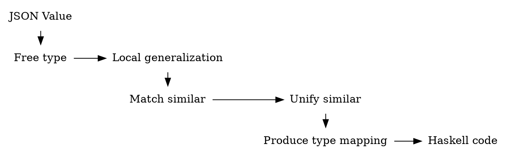

# Introduction

Typing dynamic languages has been long
considered a challenge [@javascript-inference],
but the importance
of the task grows with ubiquity
of JSON cloud APIs with only example
documents in documentation.

Past work have suggested it is possible
to infer decent type mappings
from sample data [@json-autotype-prezi]
[@quicktype] [@type-providers-f-sharp].

We expand on these results,
by presenting the framework
for type systems as learning algorithms,
formulate it mathematically,
and show its performance on
JSON API examples.

For a good comparison,
we show results of
previously described tools,
and this more principled approach.

# Problem definition

If inference fails, we can always correct it by adding additional example.

Minimal definition of the type^[We describe laws as QuickCheck[@quickcheck] properties for convenience.]:

``` {.haskell #typeclass}
class (Monoid      ty
      ,Semilattice ty)
   => ty `Types` term | ty -> term where
  infer ::         term -> ty
  check :: ty   -> term -> Bool
```

Please note that any union type defined in such way
is a _bounded meet-semilattice_
(since it always allows union of two different types):

``` {.haskell #typeclass}
class Monoid ty
   => Semilattice ty where
   bottom, top :: ty
```
Here `bottom` stands for **no information** about possible value
 (empty term,
  without even a `null`).
  For example an empty array `[]` could be typed
  as a array type with `bottom` element type.

Naturally `top` represent **everything permitted**
or fully dynamic value, when we gathered
information that places any possible value inside the type.

This firmly places type inference as a **learning problem**,
and allows us to find the common ground
between dynamic and static typing disciplines.

Languages with static type discipline usually
treat `top` as an error, since value should have
a statically assigned type, and `bottom`
as a fully polymorphic type `forall a. a`.

Languages with dynamic type discipline will
treat `top` as untyped, dynamic value,
and `bottom` again as an unknown polymorphic value.

Note that `Monoid` operation is a union type unification.

Beside standard laws for bounded meet semilattice
with `top` as greatest element,
and monoid with a neutral element of `bottom`,
we have a law specific to types.


``` {.haskell }
class_law_types :: Types ty term => term -> Bool
class_law_types term =
  check (infer term) term
```

``` {.haskell #typeclass .hidden}
class_law_types :: Types ty term => Proxy ty -> term -> Bool
class_law_types p term =
  check_ p (infer_ p term) term
```

``` {.haskell .hidden #typeclass}
check_ :: ty `Types` term => Proxy ty -> ty -> term -> Bool
check_ _ = check
infer_ :: ty `Types` term => Proxy ty ->       term -> ty
infer_ _ = infer
```

Law asserts that the following diagram commutes:

``` { .dot width=45% height=20% #fig:type-commutes }
digraph type {
  node [shape=box,color=white];
  subgraph g {
    Bool; Type;
    rank=same;
  }
  Value -> Type [xlabel="infer"];
  Type  -> Bool [label="check with value"];
  Value -> Bool [label="const True"];
}
```

And laws
It is convenient validation when testing a recursive structure of the type.

### Definition of typelike

Alternative way to state properties of considered objects would be
to define a single class `Typelike`:
```{.haskell #Typelike}
class (Eq   ty
      ,Show ty)
   => Typelike ty where
  bottom, top :: ty
  (\/) :: ty -> ty -> ty

instance Typelike ty => Monoid ty where
  mappend = (\/)
  mempty  = bottom

instance Typelike ty => Semigroup ty where
  (<>) = (\/)

Typelike_laws name = describe ("Typelike " <> name) $ do
  describe "bottom is neutral element" $
    prop "left"  $ \t -> bottom \/ t      == t
    prop "right" $ \t -> t      \/ bottom == t
  describe "top is absorbing element" $
    prop "left"  $ \t -> top    \/ t      == top
    prop "right" $ \t -> t      \/ top    == top
  prop "commutative" $ \t u -> t \/ u == u \/ t
  prop "associative" $ \t u v ->  t \/ (u  \/ v)
                              == (t \/  u) \/ v
```

Here:

* unification is an associative, commutative operation
* bottom is neutral element of unification
* `top` is absorbing element

In case of union types, where we learn shape of the type
from examples, we can say that:

* `bottom` represents _no information received_
* `top` represents _no more information will change anything_
or _no more information accepted_
* `unify` represents fusing information
  on the same entity
  from different observations

So `Typelike` is bounded join-semilattice,
assuring existence of neutral element
of the join operation.

We call neutral element to be _no information given_
or _no observation_, and maximum to be
_no more information accepted_.

This is important, since we may
want to separate concerns about
valid domain of types/type constraints
versus concerns of the typing of the terms
by these valid types.

Note that this approach is a bit more relaxed than
full lattice subtyping[@subtype-inequalities][@subtyping-lattice],
since it only considers semilattice with unification operation.

When we consider **union Typelike**, we also have
additional laws:

```{.haskell #Typelike}
union_Typelike_laws name =
  describe ("union Typelike " <> name) $
    prop "bottom never satisfied" $
      \t -> check bottom t == False`
    prop "top always satisfied" $
      \t -> check top    t == True
```

This is design choice that does not apply when
using Typelike to represent static type discipline.

## Value domain

Since we are interested in JSON, we use Haskell encoding of JSON term for convenient reading^[As used by Aeson[@aeson] package.]:
``` {.haskell file=Aeson.hs}
data Value =
    Object (Map String Value)
  | Array  [Value]
  | String  Text
  | Number  Scientific
  | Bool    Bool
  | Null
```

## Free union type

Now for a term with constructors we can infer "free" type for every term:
For any `T` value type Set T` satisfies our notion of _free type_.
``` { .haskell #freetype }
data FreeType a = FreeType { captured :: Set a }
                | Full

instance (Ord a, Eq a) => Semigroup (FreeType a) where
  a <> b = FreeType $ (Set.union `on` captured) a b -- mappend
instance (Ord a, Eq a) => Monoid (FreeType a) where
  mempty  = FreeType Set.empty

instance (Ord a, Eq a) => Semilattice (FreeType a) where
  bottom = mempty
  top    = Full

instance (Ord      a
         ,Eq       a)
      =>  FreeType a `Types` a where
  infer                    = FreeType . Set.singleton
  check Full         _term = True
  check (FreeType s)  term = term `Set.member` s
```


This definition is sound, and for a finite realm of values, may make a sense.
For a set of inputs^[Conforming to Haskell and JSON syntax, we use list for marking the elements of the set.]:
`["yes", "no", "error"]`, we might reasonably say that type is indeed
a good approximation of C-style enumeration, or Haskell-style ADT without constructor arguments.

What is wrong with this notion of _free type_?
It does not generalize at all to infinite and recursive domains! It only allows the objects from the sample, and nothing more.

## Type system engineering principles

Given that we want to infer the type from finite number of samples
we are presented with _learning problem_,
so we need to use _prior_ knowledge of the domain
to generalize when inferring types.

Clearly after seeing `a: false` we can expect that it is sometimes `a: true`.
After seeing `b: 123` we expect that `b: 100` would also be acceptable.
That means that we need our typing to _learn a reasonable general class from few instances._
That defines making a practical type system as inference problem.

Since our goal is to deliver most descriptive^[Shortest, by information complexity principle.]
types, we will assume that we need to abstract a bit from the _free type_ and take on larger
sets whenever it seems justified.

Another principle is that of **correct operation**,
where given operations on types, we try to find a minimal types
that assure correct operation unexpected errors.

Indeed we want to use this theory to infer a type definition from a finite set of examples,
but we also want it to generalize to infinite types.

Aiming for this, we set the rules of type design:

* type should have a finite description
* inference must be contravariant functor with regards to constructors, for `{"a": X, "b": Y}` is types
  by `T x y`,
  then `X :: x` and `Y :: y` must be also a valid typing.


## Motivating examples

Now let's give some motivating examples from realm of JSON API types:

1. Subsets of constructors:
  * _API argument is email_ - this is subset of valid `String` values, that we can usefully validate on the client.
  * _Page size determines number of results to return (min: 10, max:10000)_ - this is also a subset of `Int` values between `10`, and `10000`
  * _`timestamp` contains ISO8601 date_ -- that is `String` like `"2019-03-03"` but not like `"The third day of March of the year 2019"`
2. Optional fields:
  * _Page size is 100 by default_ - that is we have `{"page_size": 50}` or `{}`
3. Variant fields:
  * _Answer to the query is either a number of of registered objects, or String `"unavailable"`_ - this is `Int` value or a `String`
4. Variant records:
  * _Answer contains either text message with user id, or an error._ -- That is either:
```{.json}
{"message" : "Where can I submit my proposal?", "uid"  : 1014}
{"error"   : "Authorization failed",            "code" :  401}
```

5. Arrays in place of records^[Which strikes author as a bad practice, but we want to handle it nevertheless. Possible with `--bad-array-records` option.]:
``` {.json file=example5.json}

[
  [1, "Nick",    null       ]
, [2, "George", "2019-04-11"]
, [3, "Olivia", "1984-05-03"]
]
```

6. Maps of identical objects:
``` { .json file=test/example6.json }
{
    "6408f5": {
        "size": 969709,
        "height": 510599,
        "difficulty": 866429.732,
        "previous": "54fced"
	},
	"54fced": {
	    "size": 991394,
        "height": 510598,
        "difficulty": 866429.823,
        "previous": "6c9589"
	},
	"6c9589": {
        "size": 990527,
        "height": 510597,
        "difficulty": 866429.931,
        "previous": "51a0cb"
	}
}
```

### What is the point of inference?

Given another undocumented (or wrongly labelled) JSON API, we want to read the input
into Haskell, and avoid checking for _unexpected_ deviations of the format.
At the same time, we want to accept all known valid inputs outright,
so that we can use types^[And compiler feature of checking for unmatched cases.]
to make sure we exhaustively treat the input.

Thus we can assume that the smallest non-singleton set is a better approximation type than a singleton.
We call it _minimal containing set principle_.

Second we can prefer types that allow for _less degrees freedom_ than the others,
while conforming to some commonly occuring structure. We call it _information content principle_.

Given these principles, and examples of frequently occuring patterns,
we can infer a reasonable _world of types_ that would be used as approximations,
instead of making this creation ad-hoc. That is _type system engineering_,
that allows us to derive type system design directly from information on data structures
and likelihood of their occurence.

### Which of these types we may infer?

#### Presence and absence constraints

After seeing `true` value we also expect
`false`, so we can say that the basic constraint
for a boolean value is its presence or absence.

```{.haskell #presence-absence-constraints}
type BoolConstraint = Bool

instance Semigroup Bool where
  (<>) = (||)

instance Monoid Bool where
  mempty = False

instance Semilattice Bool where
  bottom = False
  top    = True
```

That means that constraint for boolean
is the simplest possible

The same for `null`, since there is only one
`null` value.

``` {.haskell #presence-absence-constraints}
type NullConstraint = Bool
```

#### Simple type constraints

1. Given a sample of values, we can have a reasonable approximation of expected values:
  - use `String` versus `Int` outright, instead of any JSON `Value`.
  - assuming that we have a set of parsers that are mutually exclusive, we can implement this for `String` values:
``` {.haskell #basic-constraints}
data StringConstraint =
    SCDate
  | SCEnum (Set Text)
  | SCNever
  | SCAny
  deriving(Eq, Show,Generic)

instance StringConstraint `Types` Text where
  infer (parseDate -> Right _) = SCDate
  infer  value                 = SCEnum $
                      Set.singleton value

  check  SCDate     s = isRight $ parseDate s
  check (SCEnum vs) s = s `Set.member` vs
  check  SCNever    _ = False
  check  SCAny      _ = True
```

Then whenever unifying the `String` constraint:
```{.haskell #basic-constraints}
instance Semigroup StringConstraint where
  SCDate     <> (SCEnum _)     = SCAny
  (SCEnum a) <> (SCEnum b)
    | length a + length b < 10 = SCEnum (a <> b)
  (SCEnum a) <> (SCEnum b)     = SCAny

instance Monoid StringConstraint where
  mappend = (<>)
  mempty  = SCNever

instance Semilattice StringConstraint where
  bottom = SCNever
  top    = SCAny
```

2. Analogically we may infer for integer constraints^[Program makes it optional `--infer-int-ranges`.] as:
```{.haskell #basic-constraints}
data IntConstraint = IntRange Int Int
                   | IntNever
                   | IntAny
  deriving (Show, Eq)

instance Semigroup IntConstraint where
  IntAny       <> _            = IntAny
  IntNever     <> a            = a
  a            <> IntNever     = a
  IntRange a b <> IntRange c d =
                  IntRange (min a c) (max b d)

instance Semilattice IntConstraint where
  bottom = IntNever
  top    = IntAny

instance Monoid IntConstraint where
  mempty = bottom
```

JavaScript has one number type that holds both `Float` and `Int`, so JSON inherits that:
```{.haskell #basic-constraints}
data NumberConstraint =
    NCInt
  | NCNever
  | NCFloat
  deriving(Eq,Show,Generic)

instance Semilattice NumberConstraint where
  bottom = NCNever
  top    = NCFloat

instance Semigroup NumberConstraint where
  <<standard-rules-number-constraint>>
  NCInt <> NCInt = NCInt

instance NumberConstraint `Types` Scientific where
  infer sci
    | base10Exponent sci >= 0 = NCInt
  infer sci                   = NCFloat
  check NCFloat sci = True
  check NCInt   sci = base10Exponent sci >= 0
  check NCNever sci = False

<<standard-instances-number-constraint>>
```

```{.haskell #standard-rules-number-constraint}
NCFloat <> _       = NCFloat
_       <> NCFloat = NCFloat
NCNever <> _       = NCNever
_       <> NCNever = NCNever
```

```{.haskell .hidden #standard-instances-number-constraint}
instance Monoid NumberConstraint where
  mempty = bottom
```

#### Variants

Variant fields for union types are also simple, we implement them with a cousin of `Either` type
that assumes these types are exclusive:
```haskell
data a :|: b = AltLeft  a
             | AltRight b
  deriving (Show, Eq, Generic)

instance (FromJSON  a
         ,FromJSON        b)
      =>  FromJSON (a :|: b) where
  parseJSON a =  AltLeft  <$> decodeEither
             <|> AltRight <$> decodeEither
```
In other words for `Int :|: String` type we first check if the value is `String`, and if it fails try to parse it as `String`.

Variant records are a bit more complicated, since it is unclear which typing is better:

```{.json .javascript file=test/example1a.json}
{"message": "Where can I submit my proposal?",
    "uid" : 1014}
{"error"  : "Authorization failed",
   "code" : 401}
```

```haskell
data OurRecord =
  OurRecord { message :: Maybe String
            , error   :: Maybe String
            , code    :: Maybe Int
            , uid     :: Maybe Int }
```

Or maybe:
```haskell
data OurRecord2 = Message { message :: String
                          , uid     :: Int }
                | Error   { error   :: String
                          , code    :: Int }
```

The best attempt here, is to rely on our examples being reasonable exhaustive.
That is, we can count how many examples we have for each, and how many out of them
are matching. And then compare it to type complexity (with optionalities being more complex than lack of them.)
In this case latter definition has only one choice (optionality), but we only have two samples to begin with.

With more samples, the pattern emerges:
```{.json file=test/example1b.json}
{"error"  : "Authorization failed",
    "code":  401}
{"message": "Where can I submit my proposal?",
    "uid" : 1014}
{"message": "Sent it to HotCRP",
    "uid" :   93}
{"message": "Thanks!",
    "uid" : 1014}
{"error"  : "Missing user",
    "code":  404}
```

### Selecting basic priors

Now that we defined the type system engineering
as prior selection, let's state some obvious rules
for the typing:

1. We generalize basic datatypes:

Note that we treat `null` as separate basic types,
that can form union with any other.
Thus `bottom` indicates _no type and no value_.
The `top` of our semilattice is the type of any `Value` term.

2. We allow for unification of basic types, by typewise unification:
```{.haskell #json-types-instance}
    infer (TUnion { bool, int,  :: TPresent
                  })
```

### Conflicting alternatives

Crux of union type systems have been long
dealing with conflicting types on the input.

Motivated by examples above, we want to also deal
with conflicting alternative assignments.

It is apparent that examples 4. to 6.
hint at more than one assignment:

5. Either a list of lists of values that are one of `Int`, `String`, or `null`, or a table that has the same (and predefined) type
for each

6. Either a record of fixed names,
or the mapping from hash to a single object type.


### Number of samples

How can we make sure that we have a right number of samples?
This is another example:
```json
{"samples" : [
    {"error"   : "Authorization failed",
        "code" :  401}
  , {"message" : "Where can I submit my proposal?",
        "uid"  : 1014}
  , {"message" : "Sent it to HotCRP",
        "uid"  :   93}
  , {"message" : "Thanks!",
        "uid"  : 1014}
  , {"error"   : "Authorization failed",
        "code" :  401}
  ]
}
```
First we need to identify it as a list of same elements,
and then to notice, that there are multiple instances of each record example.
That suggests that the best would be to use not sets, but multisets
of inferred records, and attempt to minimize the term.

Next is detection of similarities between type descriptions developed
for different parts of the term:
```json
{"samples"      :  ...,
 "last_message" : {"message": "Thanks!",
                      "uid" : 1014}
}
```



Thus at each step we might want to keep a **cardinality** of each possible value,
and given enough samples, attempt to detect patterns ^[If we detect pattern to early, we risk make our types to narrow to work with actual API answers.].

In order to preserve efficiency, we might want to merge whenever, number of alternatives in the multiset crosses the threshold.
^[Option `--max-alternative-constructors=N`]
And only attempt to narrow strings when cardinality crosses the threshold ^[Option `--min-enumeration-cardinality`.]

### Object constraint

In order to avoid information loss,
constraint for JSON object type should
**simultaneously gather information** about
either representing it as a `Map`, or
a record:
```{.haskell #object-constraint}

data MappingConstraint =
  MappingConstraint {
      keyConstraint   :: StringConstraint
    , valueConstraint :: UnionType
    } deriving (Eq, Show, Generic)

instance Semilattice MappingConstraint where
  bottom = MappingConstraint {
      keyConstraint   = bottom
    , valueConstraint = bottom
    }
  top = MappingConstraint {
      keyConstraint   = top
    , valueConstraint = top
    }

instance Semigroup   MappingConstraint where
  a <> b = MappingConstraint {
      keyConstraint   =
        ((<>) `on` keyConstraint  ) a b
    , valueConstraint =
        ((<>) `on` valueConstraint) a b
    }

instance Monoid      MappingConstraint where
  mempty = bottom

data RecordConstraint =
    RCTop
  | RCBottom
  | RecordConstraint {
        fields :: HashMap Text UnionType
      } deriving (Show,Eq,Generic)

instance Semilattice RecordConstraint where
  bottom = RCBottom
  top    = RCTop

instance Semigroup   RecordConstraint where
  RCBottom <> a        = a
  a        <> RCBottom = a
  RCTop    <> _        = RCTop
  _        <> RCTop    = RCTop
  a        <> b        = RecordConstraint $
    undefined -- FIXME


instance Monoid      RecordConstraint where
  mempty = bottom

data ObjectConstraint = ObjectConstraint {
    mappingCase :: MappingConstraint
  , recordCase  :: RecordConstraint
  } deriving (Eq,Show,Generic)

instance Semigroup ObjectConstraint where
  a <> b =
    ObjectConstraint {
      mappingCase =
        ((<>) `on` mappingCase) a b
    , recordCase =
        ((<>) `on` recordCase ) a b
    }

instance Monoid ObjectConstraint where
  mempty = bottom

instance Semilattice ObjectConstraint where
  bottom = ObjectConstraint {
             mappingCase = bottom
           , recordCase  = bottom
           }
  top    = ObjectConstraint {
             mappingCase = top
           , recordCase  = top
           }

instance ObjectConstraint `Types` Object where
```

### Array constraint

Similarly to the object,
`ArrayConstraint` should simultaneously gather
information about all possible representations
of the array:

* an array of the same elements
* row with the type depending on the column

We need to gather information for both
alternatives separately, and then
measure relatively likelihood
of either case just before mapping
the union type to Haskell declaration.

```{.haskell #array-constraint}

data ArrayConstraint  = ArrayConstraint {
    arrayCase :: UnionType
  , rowCase   :: RowConstraint
  }
  deriving (Show, Eq, Generic)

instance Semilattice ArrayConstraint where
  bottom = ArrayConstraint {
             arrayCase = bottom
           , rowCase   = bottom
           }
  top = ArrayConstraint {
          arrayCase = top
        , rowCase   = top
        }

instance Semigroup ArrayConstraint where
  a1 <> a2 =
    ArrayConstraint {
      arrayCase = ((<>) `on` arrayCase) a1 a2
    , rowCase   = ((<>) `on` rowCase  ) a1 a2
    }

instance Monoid ArrayConstraint where
  mempty = bottom

<<row-constraint>>

instance ArrayConstraint `Types` Array
```

### Row constraint

Row constraint is valid only if
there is a fixed number of entries in each
row, which we represent by escaping to the `top`
whenever there is uneven number of columns.

``` {.haskell #row-constraint}
data RowConstraint =
     RowTop
   | RowBottom
   | Row       [UnionType]
   deriving (Eq,Show,Generic)

instance Semilattice RowConstraint where
  bottom = RowBottom
  top    = RowTop

instance Monoid RowConstraint where
  mempty = bottom

instance Semigroup RowConstraint where
  <<rowconstraint-standard-lattice-rules>>
  Row bs    <> Row cs
    | length bs /= length cs = RowTop
  Row bs    <> Row cs        =
    Row $ zipWith (<>) bs cs
```

In other words, `RowConstraint` is a _levitated
semilattice_[@levitated-lattice]
with neutral element over content
type `[UnionType]`.

```{.haskell #row-constraint-standard-rules .hidden}
RowBottom <> r         = r
r         <> RowBottom = r
RowTop    <> _         = RowTop
_         <> RowTop    = RowTop
```

### Putting it together into a union

Since we have a union of just few possible constraints,
we make it a record for easier processing:

Note that given constraints for different type
constructors, union type can be though of
as almost generic[@generic-monoid]^[Which likely makes it easily expressible with HKDT[@hkdt-blog][@hkdt-barbies].]:

```{.haskell #type}
data UnionType =
  UnionType {
    unionNull :: Bool
  , unionBool :: Bool
  , unionNum  :: NumberConstraint
  , unionStr  :: StringConstraint
  , unionArr  :: ArrayConstraint
  , unionObj  :: ObjectConstraint
  }
  deriving (Eq,Show,Generic)

instance Semilattice  a
      => Semilattice (Maybe a) where
  bottom = Nothing
  top    = Just top

instance Semigroup UnionType where
  u1 <> u2 =
    UnionType {
      unionNull = ((<>) `on` unionNull) u1 u2
    , unionBool = ((<>) `on` unionBool) u1 u2
    , unionNum  = ((<>) `on` unionNum ) u1 u2
    , unionStr  = ((<>) `on` unionStr ) u1 u2
    , unionObj  = ((<>) `on` unionObj ) u1 u2
    , unionArr  = ((<>) `on` unionArr ) u1 u2
    }

instance Monoid UnionType where
  mempty = bottom

instance Semilattice UnionType where
  bottom = UnionType {
      unionNull = bottom
    , unionBool = bottom
    , unionNum  = bottom
    , unionStr  = bottom
    , unionObj  = bottom
    , unionArr  = bottom
    }
  top = UnionType {
      unionNull = top
    , unionBool = top
    , unionNum  = top
    , unionStr  = top
    , unionObj  = top
    , unionArr  = top
    }
```

Note that booleans and `null` values are
both denoted by trivial `Bool` constraint,
where truth denotes `top`, and false denotes
`bottom`. In other words, we only
care about presence or absence of their observation.
``` {.haskell #type}
instance Semigroup Bool where
  (<>) = (||)
instance Monoid Bool where
  mempty = False

instance Semilattice Bool where
  top = True
  bottom = False
```

``` {.haskell #union-type-instance}

instance UnionType `Types` Value where
  infer (Bool   _) = bottom { unionBool = True }
  infer  Null      = bottom { unionNull = True }
  infer (Number n) = bottom { unionNum  = infer n }
  infer (String s) = bottom { unionStr  = infer s }
  infer (Object o) = bottom { unionObj  = infer o }
  infer (Array  a) = bottom { unionArr  = infer a }
```

## Heuristics for better types

Final touch would be to postprocess assigned type
before generating it, in order to make it more resilient
to common uncertainties.

Note that these assumptions my sidestep
our validity criterion from initial part
of the paper, however they proved to work
well in practice.

### Array type with no element observations

If we have no observations of array type,
it can be inconvenient to disallow array to
contain any value at all.
Thus we make a non-monotonic step of
converting final `bottom` to `top`,
and allowing any `Value` there on the input.

That is because, our program must not have any assumptions
about these values, but at the same it should be able to
output them for debugging purposes.

### Simplification by finding unification candidates

In most JSON documents we found that
the same object was described in different
parts of the sample datastructures.
Because of that, we compare sets of labels
assigned to all objects, and propose
to unify those that have more than 60% identical labels.

For transparency, candidates found are logged for the user,
and user can also indicate them explicitly instead
of relying on automation.

We found that this greatly decreases complexity of the types,
and makes output less redundant.

## Related work

F# type providers for JSON allow to automatically
derive schema, but the type system is
_ad-hoc_[@type-providers-f-sharp].
There was attempt to automatically infer schemas
also in the PADS project [@pads],
but it does not provide a generalized type system
design methodology.
There is a program called [@quicktype] that
tries to derive types with the Markov chains
but its cost requires much more engineering
time since unit tests are case-by-case,
and there is no little underlying theory.

## Conclusion

We derive types that are valid with respect
to specification, and thus give the best information
from the input.

We define type inference as representation learning,
and type system engineering
as a meta-learning problem, where our
our **priors about
data structure induce typing rules**.

We also make a mathematical formulation of
**union type discipline** as manipulation
of bounded join-semilattices with neutral element,
that represent knowledge given about the data
structure.

We also propose a union type system engineering
methodology, justifying it by theoretical criteria,
and showing that it consistently explains
our decisions in practice.

We hope that this kind of _formally justified type
system engineering_ will be more ubiquitous
in practice, replacing _ad-hoc_ approaches
in the future.

# Bibliography

<div id="refs"/>

# Appendix

```{.haskell file=src/Unions.hs .hidden}
{-# language AllowAmbiguousTypes    #-}
{-# language DeriveGeneric          #-}
{-# language DuplicateRecordFields  #-}
{-# language FlexibleInstances      #-}
{-# language FunctionalDependencies #-}
{-# language MultiParamTypeClasses  #-}
{-# language PartialTypeSignatures  #-}
{-# language ScopedTypeVariables    #-}
{-# language StandaloneDeriving     #-}
{-# language TypeApplications       #-}
{-# language TypeOperators          #-}
{-# language TypeSynonymInstances   #-}
{-# language ViewPatterns           #-}
module Unions where

import           Data.Aeson
import           Data.Either
import           Data.Function(on)
import           Data.Proxy
import           Data.Text(Text)
import qualified Data.Text as Text
import qualified Data.Set  as Set
import           Data.Set(Set)
import           Data.Scientific
import           Data.List(sortBy)
import qualified Data.HashMap.Strict as Map
import           Data.HashMap.Strict(HashMap)
import           GHC.Generics(Generic)

<<typeclass>>
<<freetype>>
<<basic-constraints>>
<<array-constraint>>
<<object-constraint>>
<<union-type-instance>>
<<type>>

<<missing>>
```

In order to represent `FreeType` for the `Value`,
we need to add `Ord` instance for it:
``` {.haskell .hidden #missing}
instance Ord       Value where
  compare = compare `on` encodeConstructors

fromEnum' :: Enum a => a -> Integer
fromEnum' = fromIntegral . fromEnum

encodeConstructors :: Value -> [Integer]
encodeConstructors  Null      = [0]
encodeConstructors (Bool   b) = [1, fromEnum' b]
encodeConstructors (Number n) = [2,
        fromIntegral $ base10Exponent n,
        coefficient n]
encodeConstructors (String s) = 3:
  (fromEnum' <$> Text.unpack s)
encodeConstructors (Array  a) = 4:
  concatMap encodeConstructors a
encodeConstructors (Object o) =
    concatMap encodeItem      $
    sortBy (compare `on` fst) $
    Map.toList o
  where
    encodeItem (k, v) =
      (fromEnum' <$> Text.unpack k) <>
      encodeConstructors v
```

```{.haskell #missing}

parseDate :: Text -> Either String _
parseDate = undefined -- FIXME

```

```{.haskell file=test/Spec.hs .hidden}
{-# language StandaloneDeriving     #-}
module Main where

import qualified Data.HashMap.Strict as Map
import qualified Data.Vector         as Vector
import qualified Data.Text           as Text
import Data.Scientific
import Data.Aeson
import Data.Proxy
import Test.Hspec
import Test.Hspec.QuickCheck
import Test.QuickCheck
import Test.QuickCheck.Gen
import Unions

-- FIXME: use json-autotype's
instance Arbitrary Value where
  arbitrary = oneof [
      pure Null
    , Bool   <$> arbitrary
    , String <$> arbitrary
    , Number <$> arbitrary
    , Array  <$> Vector.fromList <$> listOf arbitrary
    , Object <$> Map.fromList
             <$> listOf ((,) <$> arbitrary
                             <*> arbitrary)
    ]

instance Arbitrary Text.Text where
  arbitrary = Text.pack <$> arbitrary

instance Arbitrary Scientific where
  arbitrary = scientific <$> arbitrary <*> arbitrary

main = hspec spec

spec = do
  describe "Free types" $ do
    prop "law of class Types" $
      (class_law_types (Proxy :: Proxy (FreeType Value))
         :: Value -> Bool)
  describe "JSON types" $ do
    prop "law of class Types" $
      (class_law_types (Proxy :: Proxy UnionType)
         :: Value -> Bool)

```

```{.haskell file=src/Typelike.hs}
module Typelike where
import hspec
<<Typelike>>
```

# Appendix: generic Typelike
